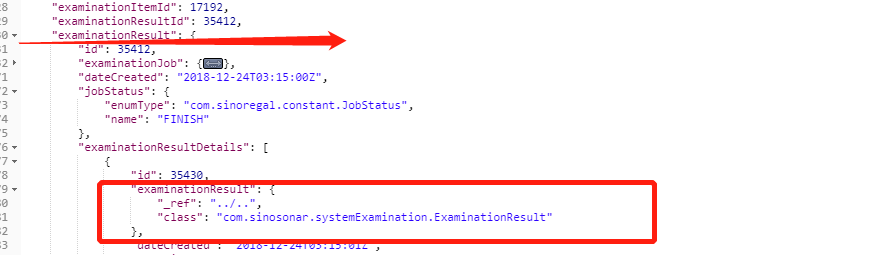

# as JSON时方案选择

## 场景
最近遇到一个场景，在比较复杂的关联关系

比如a->b->c->d。在a的列表接口，要得到b.name。在grails3的默认机制里a as JSON,只会得到b.id，得不到b.name。为了实现我们的目标

### 方案一：
```java
JSON.use('deep'){
    a as JSON
}
```

### 方案二:
```java
JSON.registerObjectMarshaller(A) { A a->
    return a.properties
}
```
#### 方案一
就是很简单粗暴，使用JSON.use('deep')会把所有的遇到的外键关联的对象给查询出来。但是这样有个问题，会不会出现无限循环。比如a->b->c->d->a。那对a做JSON.use('deep')。会不会出现
```java
a:{
    b:{
        c:{
            d:{
                a：{
                    ...
                }
            }
        }
    }
}
```
实验了一下，发现不会。遇到循环的情况，会自动处理。如下图

但是方案一会带来的问题
+ 过分加载，其实只需要b.name,但是因为domain的关联，会甚至会出现d的全量数据，这个在很损耗性能。也会带来数据泄露等问题。
+ 使用JSON.use('deep')还有一个问题，是会覆盖其他的Marshaller，比如有一个处理全局Date类型返回格式的Marshaller
```java
   JSON.registerObjectMarshaller(Date) {
            String fmt = "yyyy-MM-dd HH:mm:ss"
            return it.format(fmt)
        }
```
在你使用了JSON.use('deep')后，就会失效

#### 方案二

使用registerObjectMarshaller去控制结果字段的返回。用了return a.properties后确实可以做到得到b.name

优点:
 + 其实因为a.properties做到的效果，其实就是返回a的子属性，只会返回到b这一级的完成数据，b关联的c,只会得到c.id。这样返回的数据少得多，速度快，前端解析起来也快。
 + 如果需要a.name,b.name,c.name这样的三级数据。可以再加一个
 ```java
JSON.registerObjectMarshaller(B) { B b->
    return b.properties
}
```
这样就可以返回c.name。而不会返回过多d的数据。这样可以控制数据的层级。

缺点：
+ 直接用JSON.registerObjectMarshaller{A a}的话，效果是全局的。所以所有的A as JSON的地方都会影响到。不过可以用[JSON.createNamedConfig去实现多粒度的Marshaller](http://mrhaki.blogspot.com/2014/07/grails-goodness-using-converter-named.html)
+ return b.properties会漏掉id....所以我一般这么写
```java
JSON.registerObjectMarshaller(A) { A a ->
            def ret = [:]
            ret.id = examinationJob.id
            a.properties.findAll {k,v -> k != 'class' && k!='declaringClass'}.each {k,v -> ret.put(k, v)}
            return ret
        }
```


 


