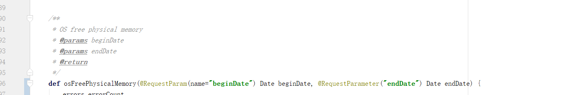
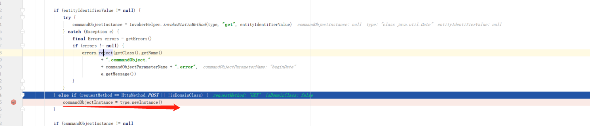

# grailscontroller直接接受Date类型的对象

## 期望
### 想要传时间类型的参数，在get请求中传入接口

### 接口定义如下


特意一个用springframework的注解声明，一个用grails.web的注解声明，
结果都无法正常得到请求值，函数里获得的beginDate和endDate对象，都是当前时间。
并且编译时有告警

### 尝试去掉注解

问题依旧，告警依旧 。

跟同事讨论后，有一个猜想

1.Date类型转化失败了，然后走了默认路径，new了一个Date对象

## 研究过程


基于这个猜想，做了尝试，在  application.yml里增加databinding的dataFormats
```java
grails:
databinding:
dateFormats:
- 'dd/MM/yyyy'
- 'dd/MM/yyyy HH:mm:ss'
- 'yyyy-MM-dd HH:mm:ss.S'
- "yyyy-MM-dd'T'hh:mm:ss'Z'"
- "yyyy-MM-dd HH:mm:ss.S z"
- "yyyy-MM-dd'T'HH:mm:ssX"
```

按这些格式传参数，依旧失败


这时想到，以前在domain类型里有一个Date字段，那时候为了put修改这个domain，传时间参数时，利用grails.databinding.dateFormats是可以正确转化成对象的Date字段的。

所以既然试了这些格式，都不行，那看来问题不在格式转化上


查询文档，在http://docs.grails.org/latest/guide/theWebLayer.html#dataBinding 看到了以下说明


所以除了，八个基础类型和它们对应的封装类（int->Integer）还有String以外。其他都属于command object分类，所以Date也属于这一类。文章里只说了基础类型

 If type conversion fails for any reason, the argument will have its default value per normal Java behavior (null for type wrapper references, false for booleans and zero for numbers) and a corresponding error will be added to the errors property of the defining controller.
 
 所以，我们只能去源码里看下command object是怎么给default value的。
 
 grails闭包和动态代理的机制，让单步变得很不方便，很多地方单步进去根本找不到对应的源码
 
 最后想到在Date类型的构造函数设置个断点。终于找到command object里Date是怎么处理的。堆栈如下


grails command object data binding


在initializeCommandObject这个函数，观察到逻辑，当是domain类型的数据时，把request里的参数读取出来，准备成entityIdentifierValue为后面的data binding做准备。

```java
final GrailsWebRequest webRequest = GrailsWebRequest
.lookup(request)
entityIdentifierValue = webRequest?.getParams().getIdentifier()
```

当不是domain,也不是String时，entityIdentifierValue就没有值。就走了最后最简单的一步newInstance()的逻辑



## 结论
所以结论就是目前的grails是不能直接传一个Date,除非用一个domain去包装（wrapper object）,成为一个command object。这也就解释了为什么domain的Date类型的字段，可以被数据绑定成功。这部分的内容就是（data binding wrapper object）

