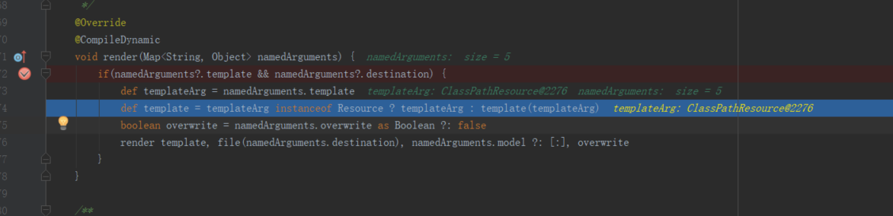
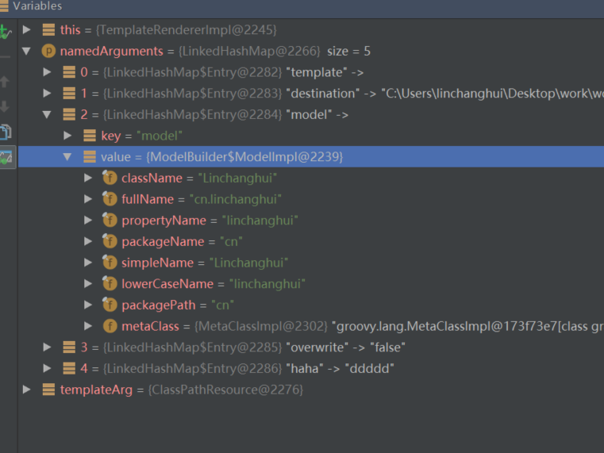
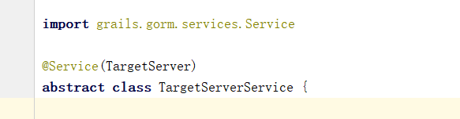
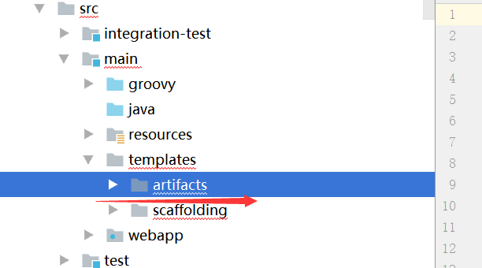
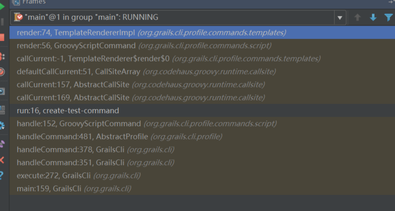

# 自定service模板

##初始预期
+ 根据domain里constraint里的信息，例如cn,size等生成较为复杂的service或者动态的service.
##预准备工作
+ 在create-service或者generate-service时，获取到domain的class.
+ 找到了根据参数和模板生成文件的核心函数render，如下

##尝试
+ 在运行命令时获取domain，想到两种方法可以尝试
    - grails常用application去获取bean。但是才想起来运行create-service等命令时，grails应用根本没有启动，所以不能用def application
    - 这时就只能尝试反射的方式。就算用反射强行搞一个domain出来。
+ domain的东西没如何输入到render函数里。
    - 观察namedArguments.model这个存储参数的变量可以支持设置哪些参数
    - 发现render函数不支持外部输入自定义map，model这个类里也都是一些类名包名的变量，没有放layout之类的约束信息的地方。model的成员如图
    
+ 所以做到最后，放弃了改用原来gorm的service模板。类似

    - 不用默认的interface而改为abstract，目的是使用spring data作为service的同时，兼顾service的可扩展性（可以在abstract去实现一些方法）
## 自定义模板的位置

+ 这里的注意点是默认的模板放在scaffolding目录下，但是你基于模板修改出来的新模板必须放在artifacts目录下，才能生效而不是原目录。这是跟踪源码（可以在TemplateRendererImpl里设置断点观察）发现的.根据模板生成文件的源码堆栈如下

